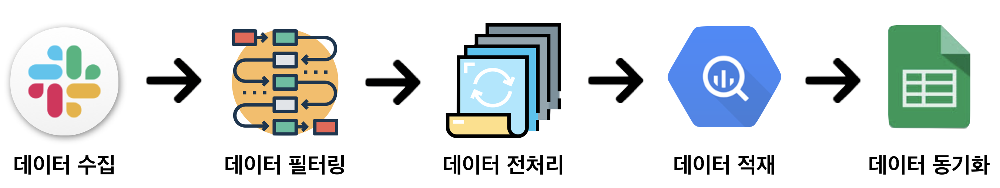

# Genie: 글또의 자동화 요정, 지니 프로젝트
## 글또란?
- 개발블로그를 꾸준히 키우고 싶은 개발자들이 자발적으로 모여, 한 달에 두 번씩 글을 쓰는 (강제) 글쓰기 모임
<br>

### 글또 글 제출 / 패스권 사용 / 상호 피드백 규칙
#### 1. 글 제출
- **기한** : 마감일 새벽 2시 (매달 둘째 주, 넷째 주 일요일에서 월요일로 넘어가는 새벽)
- **방법** : 슬랙에서 내가 속한 채널에 쓴 글의 url을 메세지로 전송 후 셀프로 `submit` 리액션 달기

#### 2. 패스권 사용
- **기한** : 마감일 자정 (매달 둘째 주, 넷째 주 일요일 밤)
- **방법** : 슬랙에서 내가 속한 채널에 '패스권을 사용합니다!' 라는 메세지와 함께 셀프로 `pass` 리액션 달기

#### 3.  상호 피드백
- **기한** : 마감일 자정 (매달 둘째 주, 넷째 주 일요일 밤)
- **피드백 대상** : 매 마감별로 나한테 지정된 리뷰어 2명 (같은 팀 1명, 다른 팀 1명)
- **방법** : 내가 피드백 해야하는 리뷰어가 **저번 마감** 때 작성했던 글을 읽고, 글이 제출되었던 메세지에 **스레드**로 피드백 내용 달아준 후 셀프로 `feedback` 리액션 달기
<br>
<br>

## 지니 프로젝트란?
- 글또 슬랙 데이터를 수집해서 각 멤버가 마감 내에 글을 제출했는지 체킹하는 과정을 자동화하기 위한 프로젝트
- 2019년 하반기 현재, 글또 3기에서는 **글 제출 + 상호 피드백** 체킹을 자동화하여 사용하고 있습니다.
<br>

### 기본 아이디어

<p align="center"></p>

1. 매 마감일마다, 글또 슬랙에서 데이터를 추출
2. 추출한 데이터에서 각 멤버가 글을 제 시간에 제출했는지, 또는 pass권을 사용했는지 등의 정보를 적절한 로직으로 데이터 필터링
3. 필터링 된 데이터를 전처리해서 `url`, `제출 시각`, `pass권 사용 여부`, `타 멤버 글 피드백 여부` 등을 수집
4. 전처리 된 데이터를 BigQuery에 전송 및 적재
5. BigQuery에서 글또 마감 현황 스프레드시트로 동기화
<br>

### 데이터 필터링 로직
#### 1. 글 제출 체크 (2am)
- **1차 필터링 - deadline** : 저번 마감 시간과 이번 마감 시간 사이에 속하는 메세지 골라내기
- **2차 필터링 - self reaction** : self로 `submit` reaction을 달아놓은 메세지인지 확인
- 위 필터링을 모두 만족하면 마감 내에 정상 제출된 메세지이므로, 메세지 내에서 `url`, `time`, `message_id` 등의 데이터 저장

#### 2. 패스권 사용 체크 (12am)
- **1차 필터링 - deadline** : 저번 마감 시간과 이번 마감 시간 사이에 속하는 메세지 골라내기
- **2차 필터링 - self reaction** : self로 `pass` reaction을 달아놓은 메세지인지 확인
- 위 필터링을 만족하면 마감 내에 정상적으로 패스권이 사용된 메세지이므로, `pass=True` 값 저장

#### 3. 상호 피드백 체크 (12am)
- **1차 필터링 - 스레드** : 피드백은 글이 제출된 메세지에 스레드로 작성하므로, 스레드인 메세지 골라내기
- **2차 필터링 - 피드백 deadline** : "저번 마감일 12am ~ 이번 마감일 12am" 사이에 속하는 메세지 골라내기
- **3차 필터링 - 원글 deadline** : 피드백 스레드의 원 글(parent) 메세지가 저번 마감에 쓰인 글인지 확인
- **4차 필터링 - self raction** : self로 `feedback` reaction을 달아놓은 메세지인지 확인
- **5차 필터링 - 리뷰어** : 피드백을 이번 마감에 지정되어있던 사람에게 한 게 맞는지 확인
- 위 필터링을 모두 만족하면 피드백 해야 하는 대상에게 제대로 한 것이므로, `feedback=True`, `reviewer={이름}` 으로 데이터 저장
- 만약 피드백을 해야하는 대상이 저번 마감에 글을 제출하지 않았거나 pass권을 사용했다면 피드백 할 필요가 없으므로, `feedback=True`, `reviewer=-1` 으로 데이터 저장
<br>
<br>

## Code Details
### Architecture
```
genie
├── config : 설정 관련 데이터
├── outputs : slack에서 가져온 데이터 저장
├── common
│   ├── main.py : 메인 실행 스크립트
│   ├── slack_export.py : slack 데이터 추출 스크립트
│   ├── checker.py : slack message에서 글 제출 확인 로직
│   └── extract_data.py : bigquery 및 json data 처리
└── tests : 테스트 코드
    ├── test_checker.py : test case 실행
    └── README.md : pytest 관련 자료 모음
```

### Install Environment
```
virtualenv env
source env/bin/activate
pip3 install -r requirements.txt
```

### Slack Token 환경 변수 지정
- Terminal에서

    ```
    export SLACK_TOKEN='your_token'    
    ```

### Run
#### \# `common/main.py` 실행

```
python common/main.py --channel_prefix 3_
               --gbq_phase production
               --deadline 2019-07-22
               --run_all False
```
  - **`channel_prefix`** : 추출하기 원하는 채널의 접두사 (ex. `1_`, `2_` 등)
  - **`gbq_phase`** : 실행시키는 용도 (`development` 또는 `production`으로 입력)
  - **`deadline`** : 현재 제출의 마감 기한 (`yyyy-mm-dd` 형태로 입력) (추후 crontab으로 자동화하면서 직접 입력해 줄 필요 없어질 예정)
  - **`run_all`** : `True` - 모든 deadline에 대해 체크 / `False` - 이번 deadline에 대해서만 체크

### Crontab
- To Be Update
<br>
<br>

## Reference
- 슬랙 데이터 추출 : [slack_export](https://github.com/zach-snell/slack-export)
